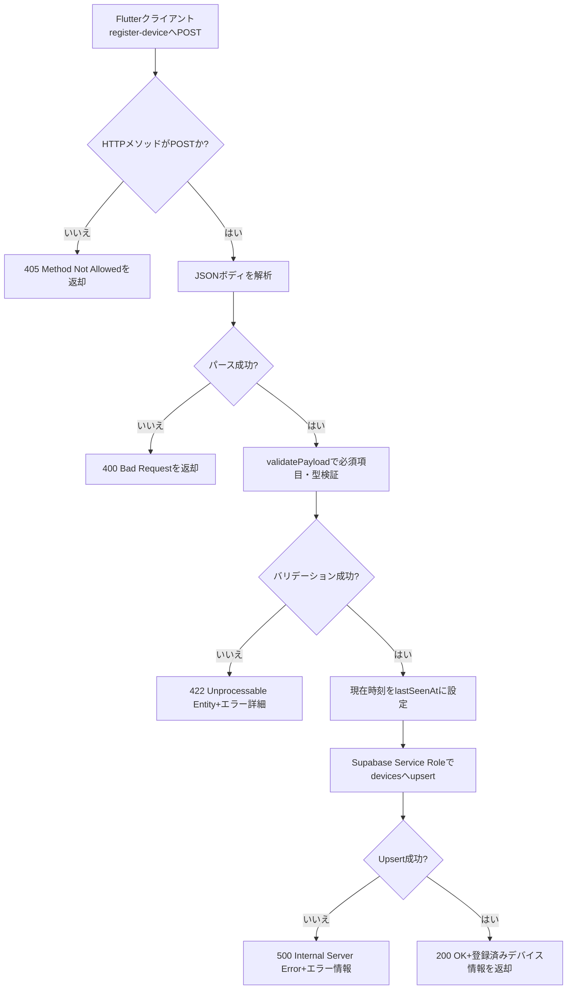

# Edge Function: register-device 設計ドキュメント

## 概要
Supabase Edge Function を用いて端末情報を `devices` テーブルに登録・更新する。匿名端末を識別する `device_key` を基準に upsert を行い、最新の FCM トークンやタイムゾーンなどを保持する。

## エンドポイント
- メソッド: `POST`
- パス: `/register-device`
- 実行環境: Supabase Edge Runtime（supabase-edge-runtime-1.69.12, Deno v2.1 系）
- 認証: ローカル開発では Supabase CLI 付属のデモトークンを利用。本番環境では RLS と Edge Function シークレットで制御予定。

## リクエスト仕様
| フィールド | 型 | 必須 | 説明 |
| --- | --- | --- | --- |
| `deviceKey` | string | 必須 | 端末一意キー（UUID など） |
| `fcmToken` | string | 必須 | Firebase Cloud Messaging のトークン |
| `platform` | string | 必須 | `ios` / `android` / `web` のいずれか |
| `timezone` | string | 任意 | 端末タイムゾーン（例: `Asia/Tokyo`） |
| `locale` | string | 任意 | ロケール（例: `ja-JP`） |
| `appVersion` | string | 任意 | アプリバージョン |

- リクエストボディは JSON。非 JSON の場合は 400 を返す。
- バリデーション失敗時は 422 を返し、`issues` 配列に項目・メッセージを格納。
- 許可メソッドは POST のみ。その他は 405（`Allow: POST` ヘッダー付与）。

## JSON の送信元
- フロントエンド: Flutter 製 ADHD スケジュールアプリのクライアント。
  - 初回起動時や通知トークン更新時に、端末登録 API として本関数を呼び出す。
  - 要件定義書（`document/要件定義書/ADHD_schedule_app_requirements_v0.3.md`）で定義されている「通知を受け取るためのデバイス登録・トークン更新」フローに対応。
- 呼び出しタイミング: アプリ起動直後のセットアップ、または FCM トークンがローテーションしたタイミング。
- 認証: 将来的には匿名デバイス ID と Edge Function 用シークレットを組み合わせてアクセス制御する想定。

## 処理フロー
1. HTTP メソッドと JSON ボディを検証。
2. `validatePayload` で各フィールドの型・必須チェックを実施。`platform` は `ios`/`android`/`web` 以外を拒否。
3. 検証成功時、`lastSeenAt` に現在時刻（ISO8601）を付与し、Supabase サービスロールキーで `devices` テーブルへ upsert。
   - 更新対象: `device_key`, `fcm_token`, `platform`, `timezone`, `locale`, `app_version`, `last_seen_at`
   - `onConflict: "device_key"`
4. Supabase API からエラーが返った場合は 500 としてエラーメッセージ・hint を含むレスポンスを返却。
5. 想定外例外は 500（`Unhandled error`）としてログ記録。

## 共通モジュール
- `supabase/functions/_shared/env.ts`: 必須環境変数の取得ヘルパー。
- `supabase/functions/_shared/supabaseClient.ts`: サービスロールクライアントを生成・キャッシュ。
- `supabase/functions/_shared/http.ts`: JSON レスポンス／エラーレスポンス生成ユーティリティ。
- `supabase/functions/register-device/handler.ts`: バリデーションとビジネスロジックを保持するハンドラ。`index.ts` から呼び出している。

## 環境変数
Edge Function から Supabase を呼び出すため、以下を `.env` および `supabase secrets` に登録する。`SUPABASE_` 接頭辞は Edge Runtime で無視されるため、代替キー名を使用。

- `EDGE_SUPABASE_URL`
- `EDGE_SUPABASE_SERVICE_ROLE_KEY`

## テスト
- 単体テスト: `supabase/functions/register-device/index_test.ts`
  - `StubDevicesRepository` を利用して 405/400/422/500/200 の応答パターンをカバー。
  - 実行コマンド: `deno test supabase/functions/register-device/index_test.ts`
- ローカル統合確認: `supabase functions serve register-device --env-file supabase/.env` を起動後、`curl` で POST リクエストを送信。`200 OK` と upsert 結果が得られることを確認。

## 今後の検討事項
- FCM トークンの無効化検知・クリーンアップ（重複トークン管理）。
- pgRLS と連携した `device_key` ベースのアクセス制御強化。
- Edge Functions で共通利用するログ／通知送信ユーティリティの `_shared` への追加。
- `scan-and-fire` など他関数の設計ドキュメントも同ディレクトリに蓄積予定。
